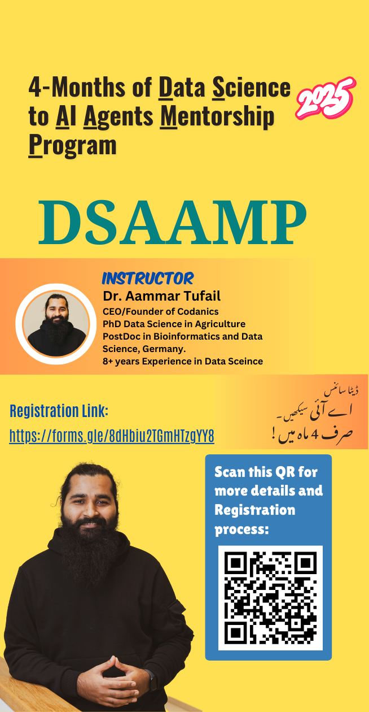

# 4-Months of Data Science to AI Agents Mentorship Program (DSAAMP)

This mentorship program/course will continue for 4 months, covering the  advance use of Python for Data Science and Machine learning, Deep Learning and AI (Generative & Agentic AI) from Intermediate-Advance level (See content below).

> This is an Advance Data Science and AI (Generative and Agentic AI) Mentorship Program (DSAAMP)-Online only-via Learning Management System (LMS)+Zoom Meetings
> You can find more informatioin about the program on the [DSAAMP](https://codanics.com/courses/dsaamp/) page or click the image below to visit the page.

## Content:
- [4-Months of Data Science to AI Agents Mentorship Program (DSAAMP)](#4-months-of-data-science-to-ai-agents-mentorship-program-dsaamp)
  - [Content:](#content)
  - [Program Goals:](#program-goals)
  - [Pre-requisites:](#pre-requisites)
  - [1. Making a Portfolio:](#1-making-a-portfolio)
    - [1.1. Portfolio Making using mkdocs:](#11-portfolio-making-using-mkdocs)
  - [2. Environments for Data Science and AI](#2-environments-for-data-science-and-ai)

## Program Goals:
The Data Science to AI Agents Mentorship Program aims to:
1. Master Advanced Data Science – Equip you with cutting-edge data science techniques and best practices.
2. Develop & Deploy AI Models – Train you in Machine Learning (ML) and Deep Learning (DL) for real-world projects, including deployment.
3. Build a Strong Portfolio – Guide you in developing impactful data science projects to showcase your skills.
4. Leverage AI & GenAI for Learning – Teach you how to use Artificial Intelligence (AI) & Generative AI (GenAI) to accelerate your learning and career growth.
5. Create AI Agents – Enable you to build AI-powered agents using specialized Python libraries and industry tools.
6. Develop Chatbots & AI Assistants – Help you design and implement intelligent chatbots for various applications.
7. Fine-Tune Large Language Models (LLMs) – Teach you how to customize LLMs for personal or business use.
8. Unlock Scholarships & Job Opportunities – Provide guidance on how to use your skills, portfolio, and projects to secure scholarships and jobs.
9. Stay Ahead in AI Advancements – Keep you updated with the latest developments in AI as the field evolves.
10. 🚀 And much more! This program will help you stay ahead in the rapidly growing AI landscape.

## Pre-requisites:
1. MS Excel Basic to Advance: https://youtu.be/beyqGvGaaxY 
2. Python programming for Data Science: https://youtu.be/glFfZcxwhtE 
3. Please watch these additional lectures before the start of DSAAMP (optional but recommended):
    - MS Excel Basic to Advance (Important): https://youtu.be/beyqGvGaaxY 
    - Python programming for Data Science (Important): https://youtu.be/glFfZcxwhtE 
    - Mathematics for Data Science: https://youtu.be/yDzJ4tgaN7A  
    - Statistics for Data Science: https://youtu.be/9jkFZPI5puo 
    - Data Gathering: https://youtu.be/WinjDVx2RUk 
    - Data Pre-processing: https://youtu.be/DjRBGShE8x8 
    - Exploratory Data Analysis: https://youtu.be/cb6jx33lYTc 
    - Data Visualization: https://youtu.be/MqppsRq3EJQ 
    - Git and GitHub Crash Course: https://youtube.com/live/iJAGwErBFrU?feature=share 
    - Machine Learning Crash Course Part-1: https://youtu.be/hJzhyQeGSt4 
    - Machine Learning Crash Course Part-2: https://youtu.be/_XWFycw06CM 
    - Deep Learning Crash Course Part-1: https://youtu.be/67nopa4ovJs 
    - Deep Learning Crash Course Part-2: https://youtu.be/btkXZNzsG0c 
    - Time Series Data Analysis and Forecasting: https://youtu.be/SXz_NejwXuI 

## 1. Making a Portfolio:
- **Portfolio**: A portfolio is a collection of your work that showcases your skills, projects, and achievements. It serves as a visual representation of your capabilities and can be used to impress potential employers or clients.
- **Importance**: A strong portfolio is essential for job seekers in the data science and AI fields. It demonstrates your practical experience, problem-solving abilities, and creativity. Employers often prefer candidates with a well-structured portfolio that highlights their best work.
- **How to Create a Portfolio**: 
  - Choose a platform (e.g., GitHub, personal website) to host your portfolio.
  - Select projects that showcase your skills and diversity in data science and AI.
  - Write clear descriptions for each project, including the problem statement, approach, and results.
  - Use visuals (charts, graphs) to enhance the presentation of your work.
  - Keep it updated with new projects and achievements.
- **Tips**:
  - Focus on quality over quantity. Choose a few standout projects rather than many mediocre ones.
  - Tailor your portfolio to the specific job or industry you're targeting.
  - Include links to your GitHub repositories, LinkedIn profile, and any relevant certifications.
  - Seek feedback from peers or mentors to improve your portfolio.

### 1.1. Portfolio Making using mkdocs:

- **mkdocs**: mkdocs is a static site generator that allows you to create beautiful documentation websites using Markdown. It is particularly useful for creating project portfolios, as it provides a simple way to organize and present your work.

Here is the complete guide to creating a portfolio using mkdocs-[Guide to make portfolio using Mkdocs](./01_portfolio/mkdocs-github-pages-guide.md)

## 2. Environments for Data Science and AI

Environments are isolated spaces where you can install packages and dependencies without affecting the global Python installation or other environments. Here you can see:
>[A complet guide conda/miniconda/mamba/python environments](./02_environments/enviornments_in_python.md)

---
<h1 style="font-family: 'poppins'; font-weight: bold; color: Green;">👨‍💻Author: Dr. Muhammad Aammar Tufail</h1>

 
 
  

 
 
  

 
 

---